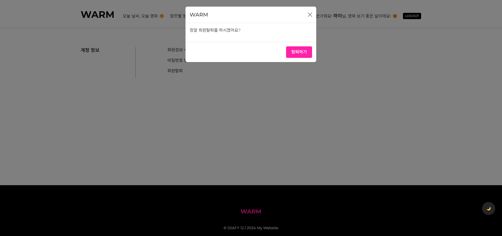
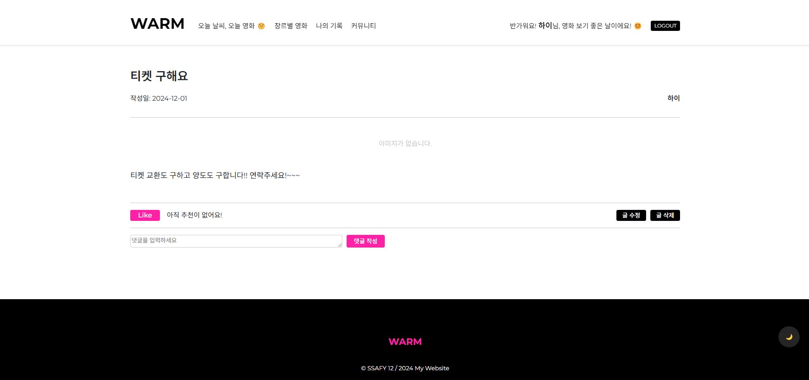

# SSAFY 1학기 관통 프로젝트

## 프로젝트 결과

### 1. 서비스 설명 및 기획 의도

* 서비스 명 :
  
  WARM - Weather And Region Movie 의 약자로, 위치 기반 날씨 데이터 바탕의 영화 추천 서비스

* 기획 의도 : 

  일반적인 추천 알고리즘에서 벗어나 사용자의 실제 주변 환경을 고려한 알고리즘의 필요성을 느낌. 여러 요소 중 날씨라는 환경 요소를 선택해 알고리즘에 접목하고,
  실시간 날씨 데이터를 활용하여 개인화된 사용자 맞춤형 데이터를 바탕으로
  사용자에게 편리함을 제공하고자 함.

### 2. 팀 및 역할 분담

* 프로젝트 진행 날짜 : 2024-11-18 ~ 2024-11-27

* 역할 분담

    | 팀원   | 업무 내용                                                    |      |
    | ------ | ------------------------------------------------------------ | ---- |
    | 김희수 | 1. 영화 리스트 페이지 및 상세 페이지 구현, 영화 데이터 fixtures 만들기, 메인 페이지 구현, 나의 기록 페이지 구현, 디자인, CSS |      |
    | 노진원 | 1. ERD 모델구성, 회원단, 커뮤니티 전체 기능 구현, 날씨 기반 알고리즘 구현, 애니메이션 효과, 검색 기능, CSS |      |

 
### 3. 목표 서비스 구현 및 진행 상황

* 인증 및 추천 알고리즘 구현
  - Django의 내장 인증 시스템 사용, 세션 기반 인증 활용
  - 알고리즘은 API를 통해 지역, 날씨 데이터를 수집하여 필요한 정보들을 매핑, 사용자가 직접 장르를 선택하여 해당 선호도에 따른 가중치 값으로 한 번 더 필터링 진행 후 추천

* 회원단 관련 기능
  - 회원가입
  - 회원탈퇴
  - 로그인
  - 로그아웃
  - 비밀번호 찾기

* 영화 관련 기능
  - 메인 알고리즘을 이용한 영화 추천 기능 > 선호 장르 및 날씨, 위치로 필터링 된 상태에서 온도 가중치로 한 번 더 필터링
  - 영화 장르별 노출 기능
  - 영화 디테일 페이지 + 댓글 작성 및 삭제 기능
  - 영화 찜(좋아요) 기능 > 영화 리스트가 노출되는 모든 페이지에서 연동
  - 장르별 best 영화 노출
  - 랜덤 영화 추천 기능

* 커뮤니티 기능
  - 게시글 작성 및 수정, 삭제 기능
  - 게시글 댓글 및 대댓글 작성, 삭제 기능
  - 게시글 추천 및 조회수 기능

* 기타 -> 나의 기록
  - 내가 찜(좋아요) 한 영화, 내가 작성한 영화 댓글 및 커뮤니티 작성 글, 댓글, 대댓글을 모아서 확인할 수 있는 기능

* 추가 기능 구현
  - 아이디 찾기
  - 비밀번호 찾기
  - 다크 모드
  - 반응형

### 4. ERD


### 5. 와이어 프레임


### 6. 기능

#### 

#### A. 회원단 - 회원가입 / 회원탈퇴 / 로그인 / 로그아웃


1) 회원가입

* django의 기본 유저모델을 상속한 CustomUserModel 생성
  * User = get_user_model()를 통해 현재 유저를 받아옴  
  * favorite_genres 는 m:n으로 사용자와 영화와 연결 하였음
  사용자(m) <-> 장르(n) <-> 영화(m)

* CustomUserModel을 통해 CustomUserCreationForm을 생성
  * CustomUserCreationForm에서 회원 가입에 필요한 Username. password1, password2, nickname, email, name 의 설정을 진행

    * required=True, 최대 길이. label의 이름, 에러 메시지 등을 설정     
  
  * 각 필드의 에러메시지를 설정하여 한글 오류 메시지가 등장하도록 설정하였음
  
  * 위와 같이 생성한 CustomUserCreationForm 형태에 맞게 데이터를 입력하여 회원 가입 진행.
  * 회원가입 관련 에러 종류
    * 이메일과 비밀번호 유사성
    * 비밀번호1과 비밀번호2 불일치
    * 필드들의 unique 속성 -> 유일성(중복 데이터 허용X)으로 동일한 이메일이나 닉네임 사용 불가
* auth_login를 사용하여 회원가입하면 자동으로 로그인하도록 설정

---


2) 로그인

* 입력한 정보 중 아이디나 비밀번호가 옳지 않으면 django 의 기본 유저모델의 내장 기능으로 인해 오류 발생 -> 오류메시지를 통해 피드백

* createsuperuser계정으로 가입하면 local database에 데이터 저장 가능

* 로그인할 시 그 사용자에 대한 정보가 데이터베이스에 저장되고 이를 바탕으로 필요한 정보를 추출하여 사용 가능

* django의 내장 기능인 AuthenticationForm을 사용해 정보를 입력하도록 구현

* auth_login를 사용하여 올바른 정보를 입력하면 로그인 구현


3) 로그아웃

* 로그아웃 시 auth_logout를 통해 로그아웃 구현

---


4) 선호도 조사

* PreferenceForm를 사용하여 선호도 조사 형태 설정 
* get_user_model()를 사용하여 사용자 정보를 받아 온 뒤 해당 사용자의 선호 장르를 선택
  * clean_favorite_genres를 통해 최대 3개까지 선택하도록 함.
  * form.save_m2m를 통해 다대다 관계에 있는 데이터들을 저장하도록 함
  * raise를 통해 오류 메시지 출력

---


5) 사용자 정보 수정

* django의 기본 정보 수정 모델을 상속 받은 CustomUserChangeForm을 사용하여 입력 창 설정
  * 이름, 닉네임, 이메일, 생년월일, 선호 장르의 데이터를 수정하도록 하였음

---



6) 회원 탈퇴

* logout를 통해 먼저 회원탈퇴 버튼을 누르면 로그아웃 되도록 함.
* delete() 메서드를 사용해 회원정보를 삭제하여 회원탈퇴 구현
* 이 때 회원탈퇴를 할 것인지 한번 더 묻는 modal창을 띄움. 버튼을 누르자말자 탈퇴하는 것을 방지함

---


7) 비밀번호 변경 (비밀번호를 알고 있을 때)

* get_user_model를 통해 사용자의 정보를 가지고 옴
* post요청일 경우, dkango의 비밀번호 변경 폼을 상속받은 CustomPasswordChangeForm을 통해 비밀번호 변경 진행 (이전 비밀번호가 맞는 경우)
  * update_session_auth_hash를 통해 비밀번호를 변경하면 자동으로 로그아웃되도록 함.


---


8) 마이페이지

* 회원 정보 수정, 회원 탈퇴, 비밀번호 수정의 링크


#### B. 영화 리스트, 영화 상세 정보 페이지


1) 영화 리스트


* 로그인하지 않은 일반 사용자도 조회는 가능하지만, 찜이나 댓글 등의 기능 차단

* TMDB의 데이터를 기반으로, 해당 사이트 기준 인기 영화 조회 가능

* 장르별로 분류 가능

* 해당 페이지에서 검색 가능

---


2) 영화 상세 정보 페이지

* 영화의 상세 정보 조회 가능한 페이지로 개봉일, 러닝타임, 줄거리 등 조회 가능

* 해당 페이지에서 댓글 작성 가능 -> 본인이 쓴 댓글의 경우 삭제 가능


#### C. 날씨 추천 알고리즘 페이지


1) 날씨 기반 영화 추천 알고리즘


* get_weather_data 함수를 통해 현재 위치한 도시명을 입력하여 해당 도시의 날씨를 OPENWEATHERMAP API를 통해 받아옴
  * Geocoding API을 통해 한글로 입력하더라도 이에 대한 경도, 위도 데이터를 받아와 해당 위도, 경도와 일치하는 영문 도시명을 찾음
  * 이 값을 통해 대소문자를 구분하지 않고 도시명 입력 가능
  
* 이 때 도시의 날씨를 키워드로 변경하여 데이터 베이스에 해당 키워드를 가진 영화목록을 보여줌
  * 애니메이션 효과를 통해 목록이 나타나게 함

* 이후 버튼을 누르면 추가적으로 현재 온도에 대해 추가적으로 필터링 진행

* 검색 기능을 통해 추천 영화에 대해 검색 기능 제공


#### D. 커뮤니티 게시판




1) 게시판 목록

* 영화, 티켓거래, 잡담 등의 게시판 세부화 구현
  * 주제별 커뮤니티와 주제에 상관없이 작성일 기준으로 전체 커뮤니티 글 조회 가능

* 글을 클릭하여 세부 글 페이지로 이동
* 비로그인 사용자도 글 목록 조회는 가능

---


2) 글 등록

* 로그인한 사용자만 글 등록 가능

---


3) 글 수정

* 작성자와 로그인한 유저가 같을 경우 수정 버튼 활성화

* 수정 시 기존 데이터를 Form에 채워줌으로써 편리성 제공

---

4) 글 삭제

* 삭제 버튼을 통해 delete 함수 실행

* view 함수와 연결하여 구현함


#### E. 메인 및 나의 기록 페이지


1) 메인 페이지

* 날씨 기반 추천 알고리즘으로 연결되는 배너

* 새로고침 시, 랜덤으로 영화를 추천하는 항목 제공

* 장르별 인기 영화 확인할 수 있음

---


2) 나의 기록 페이지

* 내가 찜(좋아요)한 영화들과, 작성한 게시글, 댓글 등을 모아 볼 수 있는 페이지

  * 내가 찜한 영화, 나의 영화 댓글, 나의 커뮤니티 글, 나의 커뮤니티 댓글 -> 로 구성

  * 좋아요 한 영화들의 경우에는 해당 영역에서 찜(좋아요)를 해제하면 바로 사라지도록 구현

  * 항목들을 클릭하면 해당 영화 상세 페이지나 게시글 페이지도 이동할 수 있음


#### F. [추가기능] 아이디 찾기 기능 / 비밀번호 찾기 기능 / 다크 모드 기능 / 반응형


1) 아이디 찾기

* 이름과 이메일을 통해 유저의 아이디를 찾도록 함.
  * User모델의 이름과 이메일에 일치하는 아이디가 있으면 해당 아이디를 페이지에 출력하도록 함.
  * 일치하는 아이디가 없으면 에러 메시지 출력

---


2) 비밀번호 찾기(비밀번호를 모르는경우 리셋)

* Courier API를 통해 사용자의 이메일에 메일을 보내는 기능 활용 
  * env에 API키 삽입
  * 이름과 이메일을 입력하면 사용자 중 일치하는 사용자의 메일로 임시 비밀번호를 발송
    * get_random_string활용해 임시 비밀번호 생성
    * set_password를 통해 해당 사용자의 비밀번호를 임시 비밀번호로 변경
    * payload로 내가 Courier에 등록한 메일을 사용해 비밀번호를 찾고자 하는 사용자의 메일로 임시 비밀번호 발송

---


3) 다크 모드

* 스크롤 버튼 위에 직관적인 버튼 생성하여, 클릭 시 다크 모드로 전반적인 색상이 전환되도록 구현

---


4) 반응형

* 화면 가로 폭에 따라서 레이아웃 및 상단 nav 구역이 바뀌도록 반응형 구현


### 7. 오류 해결

#### 1) 트러블 슈팅!

* 노진원 :
  1) 커뮤니티의 조회수
    * 새로고침이나 동일한 사용자가 계속해서 커뮤니티 글을 조회하면 조회수가 증가하는 현상 발생
      * 세부 글 페이지로 이동할 때 세션이 유지되고 view를 데이터 베이스에 저장하는 방식으로 조회수 증가
      * 그러나 데이터베이스에 view가 저장되면 안됨
        ->  다른 사용자가 몇십만명이 조회하면 해당 사용자들의 조회에 대한 데이터가 데이터베이스에 저장되기 때문이다.
        -> 이에 대한 해결책으로 로컬 저장소에 대한 생각을 해봄.
           데이터 베이스가 아닌 해당 페이지에 조회수가 증가하도록 하면 되지 않을까?라는 생각을 해봄

  2) 한글 도시명
    * openweathermap api에서 영문 도시명으로 데이터를 받아오기 때문에 한글 사용자가 도시명을 영어로 입력해야 하는 불편함 발생
      -> 이를 해결하고자 GEOCODING API를 통해 위도, 경도 데이터를 받아와 해결 

  3) 온도 필터링
    * 온도를 추가적으로 필터링하여 영화를 추천받고자 하면 필터링이 제대로 동작하지 않았음
      -> WHY? 순차적으로 데이터를 필터링해야 하는데 view함수에서 
      정상 동작 방식 : [(선호장르 and 날씨) + 버튼 클릭시 + and(온도)] 방식으로 진행하지 않고
      잘못된 동작 방식 : [선호장르 and 날씨 and 온도]
      의 방식으로 초기화면부터 바로 영화가 필터링되어 나옴
      -> 이를 해결하고자 먼저 온도에 맞는 영화 포스터의 하단에 현재 온도에 추천! 문구가 나오도록 하였음.
      -> 이후 문구가 뜬 영화들만 필터링 하도록 view함수를 설계하여 버튼 클릭시 영화가 온도까지 필터링해서 추천되도록 하였음
 

* 김희수 : 
  
  * 영화 fixtures 데이터 만들기
    - 이 과정에서 19세 성인 영화 필터링이 되도록 수정했는데, 이미지만 걸러지고 제목은 그대로 노출 -> 데이터를 전부 리셋하고 makemigrations 부터 다시 진행하여 해결

  * 찜(좋아요) 기능 테스트 시, 새로고침을 하면 찜이 풀리는 현상 -> db엔 저장이 되어 있음 / 좋아요를 누른 데이터가 찜 아이콘에는 적용이 되지 않음
    - `movie_list` 의 view함수에도 좋아요 한 데이터를 리스트로 넘겨주고, 해당 템플릿의 js에서도 `event.target.dataset.isLiked = isLiked.toString();` 으로 계속 좋아요 한 영화 목록을 업데이트 및 유지

  * base.html에 있는 중복 코드를 주석 처리 했더니 찜(좋아요) 실행이 되지 않음, user를 확인하는 `is_authenticated` 코드가 있음에도 작동하지 않음
    - base.html에 인증 코드를 전역으로 넣어주고, body 제일 위에 csrf 토큰을 넣었더니 해결

    

#### 2) 후기

* 김희수 : 

  자잘한 오류들이 많았다. 설계를 더 꼼꼼하고 탄탄하게 하는 것이 좋을 거 같다.
  직접 개발을 해보니, js로 할 수 있는 기능의 영역이 생각보다 더 넓어서 놀랐다. FE에 관심이 있었는데, 이번 기회에 다크모드와 반응형도 한 번 경험해 보고 js 관련 에러도 많이 접할 수 있어서 좋은 기회였던 것 같다. vue로도 다시 구현을 해보고 싶다.

* 노진원 :

  설계를 통해 서비스를 구현하는 과정에서 얼마든지 문제상황이 발생할 수 있음을 알게 되었다. 이러한 과정 속에서 얼마나 유연하게 대처할 수 있고 문제를 적절히 해결할 수 있는지가 개발자에게 필요한 덕목이라고 생각하게 되었다. 

  이러한 상황에서 가장 중요한 것은 경험일 것이다. 경험을 통해 초급 개발자에서 단계적으로 중금, 고급 개발자까지 성장할 수 있는 발판을 마련할 수 있다.

  쉬지 않고 성장해야겠다!


## 개발환경

### 1. 개발 환경

#### A. 언어

* Python 3.9.x
* Django 4.2.x
* Node.js LTS
* Vue 3

#### B. 도구

* vsCode
* Chrome Browser

#### C. 아키텍쳐

* ‘Django’ & ‘Vanilla JavaScript’ (또는 CDN 방식의 Vue)


### 2. 환경 추가 설정

**필수** 사전 생성 파일

* `.env` 

  * 생성 경로 : pjt/.env

  ```
  TMDB_API_KEY=TMDB키값

  OPENWEATHERMAP_API_KEY=날씨 데이터 api key
  
  OPENAI_API_KEY=생성형 ai api key
  
  COURIER_API_KEY=비밀번호 찾기 관련 메일 api key
  ```

  
  
----


## 개발 Tip 정리 (팀원용)


### 김희수
### 1. ImportError

  * 초기 개발 환경 셋팅 시 오류 -> `ImportError: cannot import name 'config' from 'decouple’`
    1. pip uninstall decouple > decouple 패키지 제거
    2. pip install python-decouple > 다시 깔기

  * `ImportError: cannot import name 'A' from partially initialized module 'B' (most likely due to a circular import)`
    -  a에서 b를 import하고, b에서 a를 import 하고 있어서 발생하는 오류 -> 무한으로 순환해서!
    - accounts의 models.py에서 < from movies.models import Genre > 해당 부분 주석 처리하니 정상 작동

### 2. data 생성 에러

  * 데이터 fixtures 파일 생성 시 오류 -> utf-8 관련 에러 메세지가 뜬다면 아래 명령어를 터미널에 차례로 입력할 것
      1. export PYTHONIOENCODING=utf-8
      2. set PYTHONIOENCODING=utf-8
      3. python manage.py dumpdata movies --indent 4 > movies_fixtures.json


### 노진원
### 1. 이메일 API 사용방법

* django를 사용하면 메일전송이 안될 수 있음

* 에러메시지 : 10060에러 (구글 검색시 알 수 있음)
  * -> 이를 해결하고자 이메일 API Courier를 활용
  * view 함수를 활용하여 메일을 보내도록 함. 
  * API 사이트에서 회원가입을 하고 어떤 메일에서 발송할 것인지 설정해야함.

### 2. 하트 애니메이션

* keyframe을 통해 하트가 튀는 애니메이션 효과를 줄 수 있음
  * 크기 변수를 css를 통해 수정하여 구현 가능

* 자바스크립트를 통해 하트버튼 클릭시 미니하트생성 애니메이션 구현 가능
  * 이 코드는 css를 통해 원하는 하트의 모양을 가져온다.
  * 이후 자바스크립트를 통해 하트를 생성하고 rect변수에서 getBoundingClientRect함수를 사용하여 미니하트의 생성위치 추적

### 3. 계정 관련 메서드

* user.set_password
  * user를 get_user_model로 가져온다.
    * set_password : 바로 비밀번호로 설정하는 django 내장 메서드(유용할듯)
    * get_random_string(length=8) : 랜덤 문자열을 생성(길이 설정 가능)